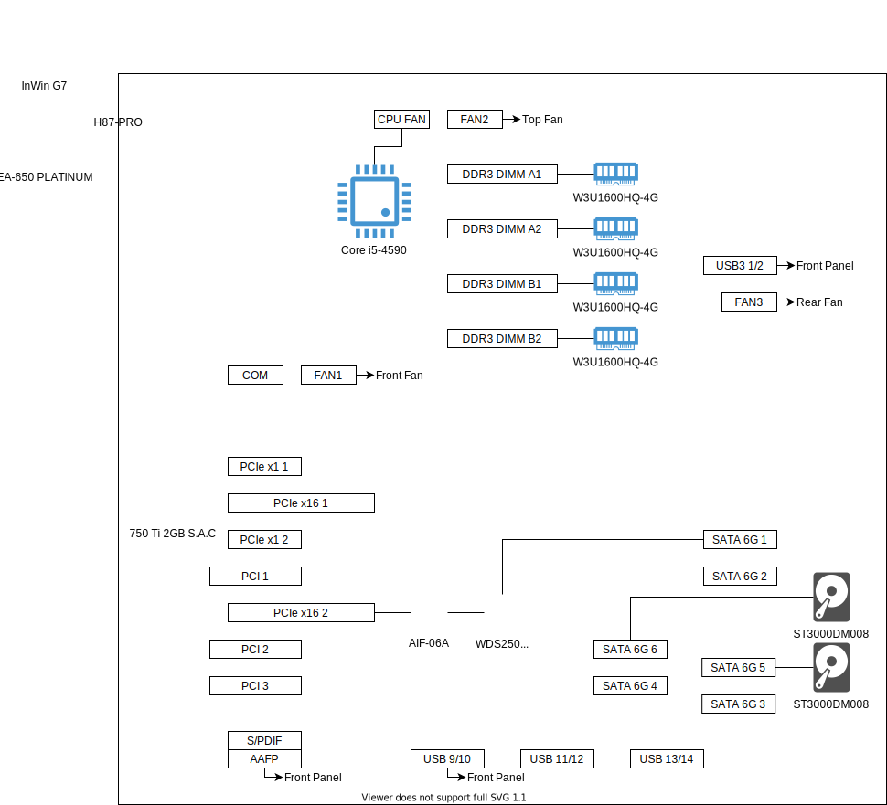

# Lisa PC

## 構成
- マザーボード: [H87-PRO](https://www.asus.com/jp/supportonly/H87-PRO/HelpDesk_Manual)
- CPU: [Core i5-4590](https://ark.intel.com/content/www/jp/ja/ark/products/80815/intel-core-i5-4590-processor-6m-cache-up-to-3-70-ghz.html)
- メモリー: [W3U1600HQ-4G](https://www.cfd.co.jp/product/memory/desk-ddr3/w3u1600hq/) x4
- グラフィックボード: [ELSA GeForce GTX 750 Ti 2GB S.A.C](https://www.elsa-jp.co.jp/products/detail/geforce-gtx750ti-2gb-sac/)
- PC ケース: [InWin G7](https://www.in-win.com/ja/gaming-chassis/G7/)
- 電源ユニット: [EA-650 PLATINUM](https://www.links.co.jp/item/ea-650-platinum-rev2/)
- CPUクーラー: (CPU 付属品)
- インターフェイスカード
  - [AIF-06A](https://www.ainex.jp/products/aif-06a/)
- SSD
  - [WDS250G2B0B](https://shop.westerndigital.com/ja-jp/products/internal-drives/wd-blue-sata-m-2-ssd)
- HDD
  - [ST3000DM008](https://www.seagate.com/jp/ja/support/internal-hard-drives/desktop-hard-drives/barracuda-3-5/) x2

以上。
